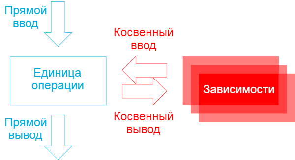
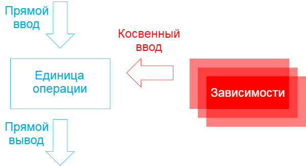
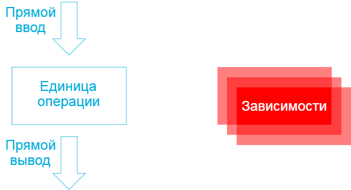
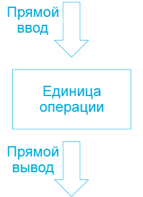

*В функциональном программировании необходимо отказаться от понятия «зависимости». Вместо этого приложения должны состоять из чистых и нечистых функций.*

Это перевод третьей статьи из серии ["От внедрения зависимостей к отказу от зависимостей"](https://blog.ploeh.dk/2017/01/27/from-dependency-injection-to-dependency-rejection/). В предыдущих статьях мы выяснили, что внедрение зависимостей не может быть функциональным, потому что из-за этого функции перестают быть чистыми. В этой статье я покажу, что можно делать вместо этого.

## Косвенный ввод и вывод

Одна из первых концепций которую усваивают при изучении программирования заключается в том, что единица операции (функция, метод, процедура) принимает входные данные и производит выходные данные. Ввод осуществляется в виде входных параметров, а вывод - в виде возвращаемых значений. Иногда, метод ничего не возвращает, но из теории категорий известно, что это "ничего" также является значением называемым *unit*.

В дополнение к такому вводу и выводу, единица операции также содержит косвенный ввод и вывод.




Когда единица операции запрашивает данные у зависимости, то такие данные называются косвенным вводом. В примере с бронированием столика ресторана, используемом в этой серии статей, когда `tryAccept` вызывает `readReservations`, то возвращаемые данные о бронировании являются косвенным вводом.

Аналогично, когда единица операции вызывает зависимость, все аргументы, переданные в эту зависимость представляют косвенный вывод. В примере, когда `tryAccept` вызывает `createReservation`, значение `reservation`, используемое в качестве входного аргумента, становится косвенным выводом. В данном случае, цель в том, чтобы сохранить бронирование в базе данных.

``` fsharp
// int -> (DateTimeOffset -> Reservation list) -> (Reservation -> int) -> Reservation
// -> int option
let tryAccept capacity readReservations createReservation reservation =
    let reservedSeats =
        readReservations reservation.Date |> List.sumBy (fun x -> x.Quantity)
    if reservedSeats + reservation.Quantity <= capacity
    then createReservation { reservation with IsAccepted = true } |> Some
    else None
```

## От косвенного вывода к прямому выводу

Вместо того, что создавать косвенный вывод, можно провести рефакторинг функции так, чтобы она создавала прямой вывод.




Такой рефакторинг часто проблематичен в популярных объектно-ориентированных языках программирования, таких как C# и Java, из-за желания контролировать условия, при которых должен создавать косвенный вывод. Косвенный вывод часто подразумевает побочные эффекты, но может быть так, что побочный эффект должен быть только при определённых условиях. В примере с бронированием ресторана желаемым побочным эффектом является добавления бронирования в базу данных, но это должно произойти только тогда, когда в ресторане достаточно свободных мест для обслуживания требуемого количества человек. Поскольку такие языки, как C# и Java, основаны на инструкциях, то может быть трудно разделить решение от действия.

В языках основанных на выражениях, таких как F# и Haskell, [легко отделить решение от действий](https://blog.ploeh.dk/2016/09/26/decoupling-decisions-from-effects).

В предыдущем примере, была версия `tryAccept` с такой сигнатурой:

``` fsharp
// int -> (DateTimeOffset -> Reservation list) -> (Reservation -> int) -> Reservation -> int option
```

Аргумент функции типа `Reservation -> int` создаёт косвенный вывод. Значение `Reservation` - это выходные данные. Функция даже нарушает принципы CQS и возвращает ID добавленного бронирования, так что это дополнительный косвенный ввод. Вся функция возвращает `int option` - ID бронирования, если оно было добавлено, и `None`, в противном случае.

Сделать рефакторинг косвенного вывода в прямой вывод легко - нужно просто удалить функцию `createReservation` и вместо этого вернуть значение `Reservation`:

``` fsharp
// int -> (DateTimeOffset -> Reservation list) -> Reservation -> Reservation option
let tryAccept capacity readReservations reservation =
    let reservedSeats =
        readReservations reservation.Date |> List.sumBy (fun x -> x.Quantity)
    if reservedSeats + reservation.Quantity <= capacity
    then { reservation with IsAccepted = true } |> Some
    else None
```

Обратите внимание, что эта переработанная версия `tryAccept` возвращает `Reservation option`. Подразумевается, что бронирование было подтверждено, если возвращаемое значение равно `Some`, и отклонено, если значение равно `None`. Решение о бронировании встроено в значение, но отделено от побочного эффекта записи в базу данных.

Очевидно, что эта функция не записывает данные в базу данных, поэтому необходимо связать решение с действием. Чтобы пример соответствовал предыдущей статье, сделаем это в функции `tryAcceptComposition`:

``` fsharp
// Reservation -> int option
let tryAcceptComposition reservation =
    reservation
    |> tryAccept 10 (DB.readReservations connectionString)
    |> Option.map (DB.createReservation connectionString)
```

Обратите внимание, что функция `tryAcceptComposition` имеет тот же тип `Reservation -> int`. Это и есть настоящий рефакторинг. API остается прежним, как и поведение. Бронирование добавляется в базу данных только при наличии достаточного количества свободных мест, и в этом случае возвращается идентификатор бронирования.

## От косвенного ввода к прямому вводу

Точно так же, как и рефакторинг с косвенного вывода на прямой, можно провести рефакторинг с косвенного ввода на прямой ввод.




Опять же, в языках, таких как C # и Java, это может быть проблематично, потому что вы можете отложить запрос или расположить его внутри единицы операции. В языках, основанных на выражениях, можно отделить решения от эффектов, и отложенное выполнение всегда может быть выполнено с помощью отложенного вычисления, если это требуется. Однако в случае текущего примера рефакторинг выполняется легко:

``` fsharp
// int -> Reservation list -> Reservation -> Reservation option
let tryAccept capacity reservations reservation =
    let reservedSeats = reservations |> List.sumBy (fun x -> x.Quantity)
    if reservedSeats + reservation.Quantity <= capacity
    then { reservation with IsAccepted = true } |> Some
    else None
```

Вместо вызова функции с побочными эффектами, эта версия `tryAccept` принимает список существующих бронирований в качестве входных данных. Функция по-прежнему суммирует уже занятые места и остальная часть кода такая же, как и раньше.

Список существующих бронирований должен откуда-то поступать, поэтому функции `tryAcceptComposition` все равно придется выполнять чтение из базы данных:

``` fsharp
// ('a -> 'b -> 'c) -> 'b -> 'a -> 'c
let flip f x y = f y x
 
// Reservation -> int option
let tryAcceptComposition reservation =
    reservation.Date
    |> DB.readReservations connectionString
    |> flip (tryAccept 10) reservation
    |> Option.map (DB.createReservation connectionString)
```

Тип и поведение этой функции остаются такими же, как и раньше, но поток данных отличается. Во-первых, функция осуществляет запрос в базу данных, что не является чистой операцией. Затем результирующий список бронирований передаётся в чистую функцию `tryAccept`. Она возвращает параметр типа `Reservation option`. Этот параметр передаётся в другой функцию с побочным эффектом, которая записывает бронирование в базу данных, если оно было подтверждено.

Я также добавил функцию `flip`, чтобы скомпоновать функции более лаконично, но можно было бы также использовать лямбда-выражение при вызове `tryAccept`. Функция `flip` является частью стандартной библиотеки Haskell, но не входит в стандартную библиотеку F#. Для примера это не имеет большого значения.

## Оценка

Заметили ли вы, что на диаграмме, приведенной выше, все стрелки между единицей операции и её зависимостями исчезли? Это означает, что у неё больше нет никаких зависимостей:




Зависимости по своей природе нечисты, и поскольку чистые функции не могут вызывать нечистые функции, функциональное программирование должно отказаться от понятия «зависимости». Чистые функции не могут зависеть от нечистых функций.

Вместо этого чистые функции должны принимать данные от прямого ввода и возвращать значения в прямой вывод, а приложение должно компоновать нечистые и чистые функции вместе так, чтобы достичь желаемого поведения.

В предыдущей статье показано, как Haskell можно использовать для оценки того, является ли реализация функциональной или нет. Можно перенести приведенный выше код F# в Haskell, чтобы убедиться, что это так.

``` haskell
tryAccept :: Int -> [Reservation] -> Reservation -> Maybe Reservation
tryAccept capacity reservations reservation =
    let reservedSeats = sum $ map quantity reservations
    in  if reservedSeats + quantity reservation <= capacity
        then Just $ reservation { isAccepted = True }
        else Nothing
```

Эта версия `tryAccept` является чистой и компилируется, но, как известно из предыдущей статьи, это не самое важное. Главный вопрос в том, компилируется ли `tryAcceptComposition`?

``` haskell
tryAcceptComposition :: Reservation -> IO (Maybe Int)
tryAcceptComposition reservation = runMaybeT $
    liftIO (DB.readReservations connectionString $ date reservation)
    >>= MaybeT . return . flip (tryAccept 10) reservation
    >>= liftIO . DB.createReservation connectionString
```

Эта версия `tryAcceptComposition` компилируется и работает как требуется. Код демонстрирует распространённый паттерн для Haskell: Во-первых, собираются данные из нечистых источников. Во-вторых, чистые данные передаются чистым функциям. В-третьих, чистый вывод из чистых функций передаётся в нечистую функцию.

Это как [бутерброд](https://blog.ploeh.dk/2020/03/02/impureim-sandwich), с лучшими частями посередине и необходимыми вещами сверху и снизу.

## Резюме

Зависимости по своей природе не являются чистыми. Они либо недетерминированы, либо имеют побочные эффекты или всё сразу. Чистые функции не могут вызывать нечистые функции (потому что это также сделало бы их нечистыми), поэтому чистые функции не могут иметь зависимостей. Функциональное программирование должно отказаться от понятия «зависимости».

Очевидно, что программное обеспечение полезно только при нечистом поведении, поэтому, вместо внедрения зависимостей, функциональные программы должны создаваться в нечистом контексте. Нечистые функции могут вызывать чистые функции, поэтому в приложении необходимо собирать нечистые данные и использовать их для вызова чистых функций. Это [автоматически приводит к архитектуре портов и адаптеров](https://blog.ploeh.dk/2016/03/18/functional-architecture-is-ports-and-adapters).

Такой стиль программирования применим довольно часто, но [это не универсальное решение; существуют и другие альтернативы](https://blog.ploeh.dk/2017/07/10/pure-interactions).
